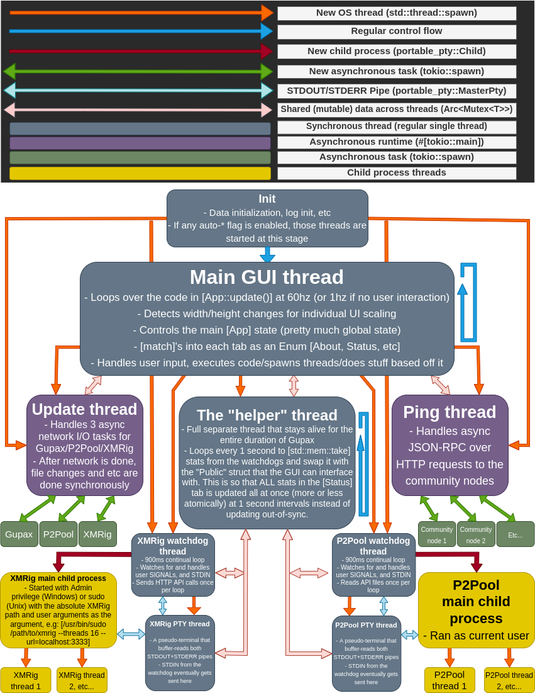

# Gupax ARCHITECTURE

** This file needs updating**

## Structure
| File/Folder  | Purpose |
|--------------|---------|
|main.rs| Launch the app.
|inits.rs| Launch the threads if auto, including XvB.
|miscs.rs| Useful functions.
|cli.rs| Command line arguments.
|app| Directory with everything related to displaying the UI.
|app/keys.rs| Handle keys input.
|app/mod.rs| Define App struct, used by egui.
|app/eframe_impl.rs| First entry to the UI.
|app/panels| All the different parts of the UI.
|disk/| Code for writing to disk: `state.toml/node.toml/pool.toml`; This holds the structs for the [State] struct.
|helper| The "helper" thread that runs for the entire duration Gupax is alive. All the processing that needs to be done without blocking the main GUI thread runs here, including everything related to handling P2Pool/XMRig/XvB.
|helper/node.rs| Node thread and principal loop.
|helper/xrig| All related thread XMRig and Xmrig-Proxy code.
|helper/xrig/xmrig.rs| XMRig thread and principal loop.
|helper/xrig/xmrig-proxy.rs| XMRig-Proxy thread and principal loop.
|helper/xvb| All related thread XvB code.
|helper/xvb/mod.rs| XvB thread and principal loop, checks and triggers, gluing every other code of this directory.
|helper/xvb/algorithm.rs| Algorithm logic with calculations and actions.
|helper/xvb/nodes.rs| Manage connection of XvB nodes.
|helper/xvb/rounds.rs| Struct for Rounds with printing and detecting of current round.
|helper/xvb/public\|private_stats| Struct to retrieve public and private stats with request.
|component| Gupax related features, like updates and nodes.


## Thread Model


Process's (both Simple/Advanced) have:
- 1 OS thread for the watchdog (API fetching, watching signals, etc)
- 1 OS thread for a PTY-Child combo (combines STDOUT/STDERR for me, nice!)
- A PTY (pseudo terminal) whose underlying type is abstracted with the [`portable_pty`](https://docs.rs/portable-pty/) library

The reason why STDOUT/STDERR is non-async is because P2Pool requires a `TTY` to take STDIN. The PTY library used, [`portable_pty`](https://docs.rs/portable-pty/), doesn't implement async traits. There seem to be tokio PTY libraries, but they are Unix-specific. Having separate PTY code for Windows/Unix is also a big pain. Since the threads will be sleeping most of the time (the pipes are lazily read and buffered), it's fine. Ideally, any I/O should be a tokio task, though.

## Bootstrap
This is how Gupax works internally when starting up:

1. **INIT**
	- Initialize custom console logging with `log`, `env_logger`
	- Initialize misc data (structs, text styles, thread count, images, etc)
	- Start initializing main `App` struct
	- Parse command arguments
	- Attempt to read disk files
	- If errors were found, set the `panic` error screen
	
2. **AUTO**
	- If `auto_update` == `true`, spawn auto-updating thread
	- If `auto_ping` == `true`, spawn remote node ping thread
	- If `auto_p2pool` == `true`, spawn P2Pool
	- If `auto_xmrig` == `true`, spawn XMRig

3. **MAIN**
	- All data should be initialized at this point, either via `state.toml` or default options
	- Start `App` frame
	- Do `App` stuff
	- If `ask_before_quit` == `true`, ask before quitting
	- Kill processes, kill connections, exit

## Scale
Every frame, the max available `[width, height]` are calculated, and those are used as a baseline for the Top/Bottom bars, containing the tabs and status bar. After that, all available space is given to the middle ui elements. The scale is calculated every frame so that all elements can scale immediately as the user adjusts it; this doesn't take as much CPU as you might think since frames are only rendered on user interaction. Some elements are subtracted a fixed number because the `ui.separator()`'s add some fixed space which needs to be accounted for.

```
Main [App] outer frame (default: [1280.0, 960.0], 4:3 aspect ratio)
   ├─ TopPanel     = height: 1/15
   ├─ BottomPanel  = height: 1/22
   ├─ CentralPanel = height: the rest
```

## Naming Scheme
This is the internal naming scheme used by Gupax when updating/creating default folders/etc:

Windows:
```
Gupax\
├─ Gupax.exe
├─ P2Pool\
│  ├─ p2pool.exe
├─ XMRig\
   ├─ xmrig.exe
```

macOS (Gupax is packaged as an `.app` on macOS):
```
Gupax.app/Contents/MacOS/
├─ gupax
├─ p2pool/
│  ├─ p2pool
├─ xmrig/
   ├─ xmrig
```

Linux:
```
gupax/
├─ gupax
├─ p2pool/
│  ├─ p2pool
├─ xmrig/
   ├─ xmrig
```

When Gupax updates, it walks the directories of the extracted `zip/tar` searching for a valid file. These are the valid filenames Gupax will match against and assume is the new binary we're looking for:
- `[GUPAX, Gupax, gupax]`
- `[P2POOL, P2Pool, P2pool, p2pool]`
- `[XMRIG, XMRig, Xmrig, xmrig]`

Windows versions of Gupax also need the file to end with `.exe`.

The actual `zip/tar` matching is static, however. They have to be packaged exactly with the following naming scheme. If an exact match is not found, it will error:
- `gupax-vX.X.X-(windows|macos|linux)-(x64|arm64)-(standalone|bundle).(zip|tar.gz)`
- `p2pool-vX.X.X-(windows|macos|linux)-(x64|aarch64).(zip|tar.gz)`
- `xmrig-X.X.X-(msvc-win64|macos-x64|macos-arm64|linux-static-x64).(zip|tar.gz)`

Exceptions (there are always exceptions...):
- XMRig doesn't have a [v], so it is [xmrig-6.18.0-...]
- XMRig separates the hash and signature
- P2Pool hashes are in UPPERCASE

## Mining Stat Reference
Some pseudo JSON for constants/equations needed for generating mining stats. They're here for easy reference, I was never good at math :)
```
block_time_in_seconds: {
	P2POOL_BLOCK_TIME: 10,
	MONERO_BLOCK_TIME: 120,
}

difficulty: {
	P2POOL_DIFFICULTY: (current_p2pool_hashrate * P2POOL_BLOCK_TIME),
	MONERO_DIFFICULTY: (current_monero_hashrate * MONERO_BLOCK_TIME),
}

hashrate_per_second: {
	P2POOL_HASHRATE: (P2POOL_DIFFICULTY / P2POOL_BLOCK_TIME),
	MONERO_HASHRATE: (MONERO_DIFFICULTY / MONERO_BLOCK_TIME),
}

mean_in_seconds: {
	P2POOL_BLOCK_MEAN: (MONERO_DIFF / P2POOL_HASHRATE),
	MY_SOLO_BLOCK_MEAN: (MONERO_DIFF / my_hashrate),
	MY_P2POOL_SHARE_MEAN: (P2POOL_DIFF / my_hashrate),
}
```


## Technical differences of column XMRig in Status Tab process sub-menu with old Gupax

Status of process for XMRig use for some information an image of data when the process started.
The node of xmrig in could not change without a restart of the process. In this fork, the node used by XMRig needs to be updated without restart (using the config HTTP API of XMRig).
So Gupax needs to refresh the value of status tab submenu process for XMRig where before the values could not change without a restart of the process.
The field node from ImgXmrig needs to be moved to PubXvbApi. This value must be updated by XMRig at start and by XvB process at runtime.

## Updates

A new option in Gupax tab advanced will enable bundled updates.
The binary included of Gupax will have default value for bundled updates depending if it is coming from the standalone or the bundled release.

Updates from Gupax will do the following differently from before v2:
- Check if using bundled or standalone with state. Update only Gupax binary if the latter or xmrig and p2pool from bundle version if the former.
- Prevent user to run updates twice without restart.
- Ask the user to restart Gupax.
- Do not verify if file P2Pool or XMRig exist. (so that the update can create them).
